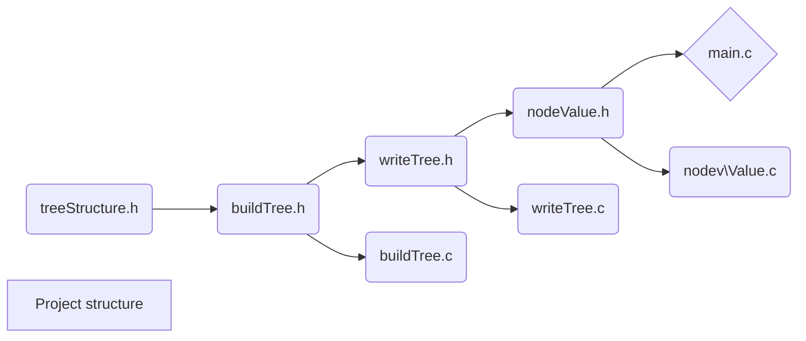
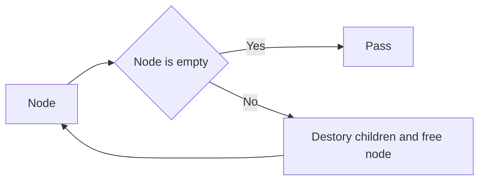
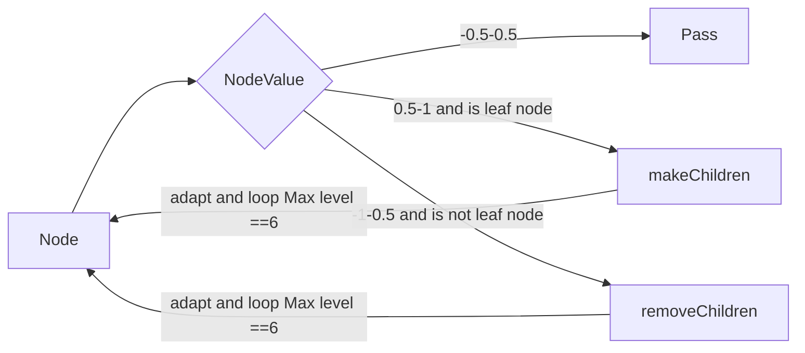

# Report of Programing project 1


This project is uploaded to github. 

https://github.com/tqhtqhtqhgo/Qtree

I use cmake to control the compile of the project.

Compile and test in terminal

```shell
cmake .
make
```

The project's header file and source file structure:




## Task 1

The function destoryTree() is wrote in the writeTree.c and call the function in writeTree().

 Algorithm:

I use the  recursion, so if a node is not empty the program need to destory children by recursion.



The function destoryTree() is :

```c
void destroyTree(Node *head){
    if(head!=NULL){
        destroyTree(head->child[0]);
        destroyTree(head->child[1]);
        destroyTree(head->child[2]);
        destroyTree(head->child[3]);
        free(head);
    }
}
```

And I call it in function writeTree() like:

```c
void writeTree( Node *head ) {
    FILE *fp = fopen("quad.out","w");
    writeNode(fp,head);
    fclose(fp);
    destroyTree(head);
}
```

After testing use valgrind and sanitizers, the function don't have memory problem.

Sanitizer is a memory analysis tool in gdb and lldb. if want to use it need to add flag in compile.

Because sanitizer and valgrind can't use at the same time, if you want to use valgrind, need to delete this line in CmakeList.txt .

```cmake
set(CMAKE_C_FLAGS "${CMAKE_C_FLAGS} -fsanitize=address")
```

Valgrind:


Sanitizer:


After debugging, the function free all memory and don't have memory warning.


And use the proflier to analysis the time of how much cpu are used ,we can see call destoryTree() one time, it takes 14.29% off all time.


## Task 2

Because assume that all children are leaf nodes.

Do not need to use recursion.

 Algorithm just need to free the child node and make the pointer to children equal to NULL.

So the function is 

```c
void removeChild(Node *root){
    for (int i = 0; i <4 ; ++i) {
        free(root->child[i]);
        root->child[i]=NULL;
    }
}
```

 Test in main.c:

```c
    makeChildren(head->child[1]->child[1]);
    removeChild(head->child[1]->child[1]);
```

By test, the program don't have memory warning or error

Valgrind:


Sanitizer:


 All memory has been freed.

Gnuplot:

makeChildren


removeChild


## Task 3

By the function given by nodeValue.c.

The  algorithm is:

if a node's nodeValue is larger than 0.5 and is leaf node then makechildren for it, else if it isn't a leaf ode and all 4 children's value  less than -0.5 then remove it.

Adapt is based on this and loop.



Valgrind:


Result of Gnuplot:

Task3( function generateTree() ):


Adapt:


## Reflection

I thought the hardest part is the  code of  task3 because of the logic is complex than task 1 and 2, and some time need to consider the time complexity. and In the process , I write some code can't run out result use long time.  

